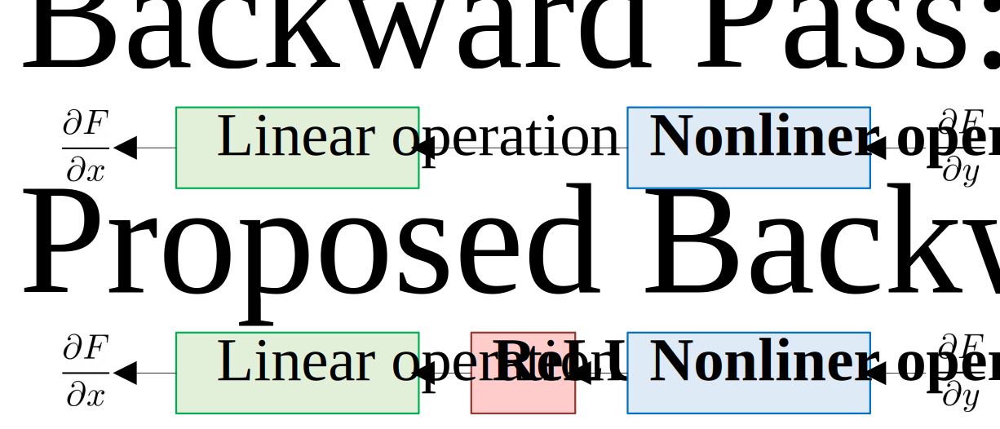

Improving Explainability of Integrated Gradients with Guided Non-Linearity
======================
This page provides the source code of the paper 
'Improving Explainability of Integrated Gradients with Guided Non-Linearity'  

## Requirements

### System
Our code requires the following environment.
  1. Ubuntu 18.04 LTS
  2. Cuda 10.0 or higher
  3. Python 3.6

### Database
We used the validation split of the ImageNet2012 dataset.
It is available at [ImageNet](http://www.image-net.org/challenges/LSVRC/2012/) or
[here](https://drive.google.com/file/d/1hlKtHCBJ02hoDPzs2sqx8mS1K7_4sSSs/view?usp=sharing).

## Installation
You can install our code with the following steps.
1. Clone and extract our code. 
2. Download validation split of ImageNet2012
3. Put extracted images in 'data/imagenet2012'
4. Install python packages with 'pip install -r requirements.txt'

## How to Run
Results in the paper can be reproduced with **'main.py'**.
It has the following options.
### options
1. method (-md): 
   - Name of the method to be used for attribution heatmap. 
   - Available options are 'integrated_gradients' for integrated gradients and 'guided_integrated_gradients' for ours.
2. model_name (-mn): 
   - You can specify networks for interpretation. 
   - Available options are 'vgg16', 'vgg19', 'resnet34', 'resnet50' and 'googlenet'.
3. start (-si):
   - Index of ImageNet validation image to start.
4. stride (-ie):
   - Index of ImageNet validation image to end.
6. end (-ei):
   - Stride for ImageNet validation samples.
8. gpu_num (-gn): 
   - GPU number for PyTorch.
   - CPU or multi-GPU is not available. 
   - Defult vaule is '0'
9.  data_dir (-da): 
    - Directory of validation split of ImageNet.
    - Default value is 'data'.

### Examples
- If you want to get attrubution heatmap of predicted class with 'ResNet50' for '171'th image by integrated gradients method (Fig 5. (a)-(d)),
   > python src/main.py -md integrated_gradients -mn ResNet50 -si 171 -ie 1 -ei 172

- If you want to get attrubution heatmap of predicted class with 'ResNet50' for '1651'th image by our method (Fig 5. (e)-(f)),
   > python src/main.py -md guided_integrated_gradients -mn ResNet50 -si 1651 -ie 1 -ei 1652

- If you want to get attribution heatmaps of predicted class with 'VGG16' for 5,000 linearly sampled images from the validation split of ImageNet by ours (Table I),
   > python src/main.py -md integrated_gradients -mn VGG16 -si 1 -ie 10 -ei 50000

## Acknowledgement
Our code is based on the PyTorch Captum Library[[1](#ref-1)]. We used implementation[[2](#ref-2)] of RISE[[3](#ref-3)] to calculate deletion/insertion scores.

****
## References
[1] https://github.com/pytorch/captum \
[2] https://github.com/eclique/RISE \
[3] Petsiuk, Vitali, Abir Das, and Kate Saenko. 
    "Rise: Randomized input sampling for explanation of black-box models." 
    arXiv preprint arXiv:1806.07421 (2018).
