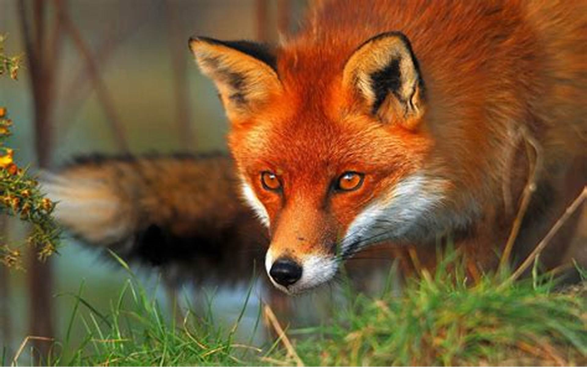
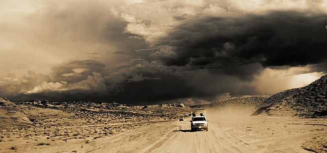
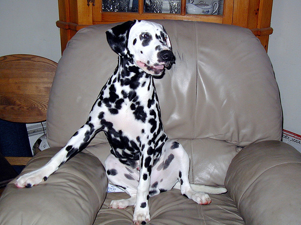

# README

<center class="half">
    
    
    
</center>

## 总览

CAM

- [x] CAM
- [x] Ablation-CAM
- [x] Eigen-CAM
- [x] EigenGrad-CAM
- [x] Full-Grad
- [x] Grad-CAM
- [x] Grad-CAM++
- [x] Grad-CAM-ElementWise
- [x] HiResCAM
- [x] Layer-CAM
- [x] RandomCAM
- [x] Score-CAM
- [x] XGrad-CAM
- [ ] Integrated Grad-CAM
- [x] Relevance-CAM

积分梯度

- [x] IG
- [x] IGOS
- [ ] Enhanced Integrated Gradients
- [ ] Guided IG

LIME

- [x] lime

LRP

- [x] LRP

## 样本阐述

**解释模型**：ResNet50、VGG19（权重及模型从Pytorch包直接导入）

**原始图片**：








**预测结果**：alp（高山，0.67）、jeep（吉普车，0.95）、jeep（吉普车，0.40）、dalmatian（达尔马提亚狗，0.999）

## 方法实况

> 左侧为VGG19，右侧为ResNet50
>
> 在所有CAM解释方法中，颜色越红表示对分类作用越强烈作用

### CAM


### Ablation-CAM


### Eigen-CAM


### EigenGrad-CAM


### Full-Grad


### Grad-CAM


### Grad-CAM-ElementWise


### Grad-CAM++


### HiResCAM


### Layer-CAM


### RandomCAM


### Score-CAM


### XGrad-CAM


### Relevance-CAM

<center class="half">
    
    
</center>


<center class="half">
    
    
</center>


<center class="half">
    
    
</center>


<center class="half">
    
    
</center>
### LIME

其中蓝色部分是对分类有正向作用的部分

<center class="half">
    
    
</center>


<center class="half">
    
    
</center>


<center class="half">
    
    
</center>


<center class="half">
    
    
</center>
### LRP

越亮的点表示对分类的作用越强烈

<center class="half">
    
    
</center>


<center class="half">
    
    
</center>


<center class="half">
    
    
</center>


<center class="half">
    
    
</center>
### IG


### IGOS

<video id="video" controls=""src="Results\IGOS\AllVideo_fps101.mp4" preload="none"></video>

<video id="video" controls=""src="Results\IGOS\AllVideo_fps102.mp4" preload="none"></video>

<video id="video" controls=""src="Results\IGOS\AllVideo_fps103.mp4" preload="none"></video>

<video id="video" controls=""src="Results\IGOS\AllVideo_fps104.mp4" preload="none"></video>

## 核心代码

### CAM

```python
# 获取权重并转化为热力图
def makeCAM(feature, weights, classes_id):
    print(feature.shape, weights.shape, classes_id)
    # batchsize, C, h, w
    bz, nc, h, w = feature.shape
    # (512,) @ (512, 7*7) = (49,)
    cam = weights[classes_id].dot(feature.reshape(nc, h * w))
    cam = cam.reshape(h, w)  # (7, 7)
    # 归一化到[0, 1]之间
    cam = (cam - cam.min()) / (cam.max() - cam.min())
    # 转换为0～255的灰度图
    cam_gray = np.uint8(255 * cam)
    # 最后，上采样操作，与网络输入的尺寸一致，并返回
    return cv2.resize(cam_gray, (224, 224))
for img in os.listdir(input_path):
    img_path = os.path.join(input_path, img)

    # 定义预训练模型: resnet18、resnet50、densenet121
    resnet18 = models.resnet18(pretrained=True)
    resnet50 = models.resnet50(pretrained=True)
    densenet121 = models.densenet121(pretrained=True)
    resnet18.eval()
    resnet50.eval()
    densenet121.eval()
	# hook用于获取变量的中间结果
    # =====注册hook start=====
    feature_data = []
    resnet18._modules.get('layer4').register_forward_hook(feature_hook)
    resnet50._modules.get('layer4').register_forward_hook(feature_hook)
    densenet121._modules.get('features').register_forward_hook(feature_hook)
    # =====注册hook end=====

    # 获取fc层的权重
    fc_weights_resnet18 = resnet18._modules.get('fc').weight.data.numpy()
    fc_weights_resnet50 = resnet50._modules.get('fc').weight.data.numpy()
    fc_weights_densenet121 = densenet121._modules.get('classifier').weight.data.numpy()

    # 图片数据转换
    image_transform = transforms.Compose([
        # 将输入图片resize成统一尺寸
        transforms.Resize([224, 224]),
        # 将图片灰度值255归一化到[0,1]之间
        transforms.ToTensor(),
        # 标准化处理
        transforms.Normalize(
            mean=[0.485, 0.456, 0.406],
            std=[0.229, 0.224, 0.225]
        )
    ])
    # 获取预测类别id
    image = image_transform(Image.open(img_path)).unsqueeze(0)
    out_resnet18 = resnet18(image)
    out_resnet50 = resnet50(image)
    out_densenet121 = densenet121(image)
    predict_classes_id_resnet18 = np.argmax(F.softmax(out_resnet18, dim=1).data.numpy())
    predict_classes_id_resnet50 = np.argmax(F.softmax(out_resnet50, dim=1).data.numpy())
    predict_classes_id_densenet121 = np.argmax(F.softmax(out_densenet121, dim=1).data.numpy())
	# 将全连接层的权重转化为热力图及cam
    cam_gray_resnet18 = makeCAM(feature_data[0], fc_weights_resnet18, predict_classes_id_resnet18)
    cam_gray_resnet50 = makeCAM(feature_data[1], fc_weights_resnet50, predict_classes_id_resnet50)
    cam_gray_densenet121 = makeCAM(feature_data[2], fc_weights_densenet121, predict_classes_id_densenet121)
    # 叠加CAM和原图，并保存图片
    # 1)读取原图
    src_image = cv2.imread(img_path)
    h, w, _ = src_image.shape
    # 2)cam转换成与原图大小一致的彩色度(cv2.COLORMAP_HSV为彩色图的其中一种类型)
    cam_color_resnet18 = cv2.applyColorMap(cv2.resize(cam_gray_resnet18, (w, h)),
                                        cv2.COLORMAP_HSV)
    cam_color_resnet50 = cv2.applyColorMap(cv2.resize(cam_gray_resnet50, (w, h)),
                                        cv2.COLORMAP_HSV)
    cam_color_densenet121 = cv2.applyColorMap(cv2.resize(cam_gray_densenet121, (w, h)),
                                            cv2.COLORMAP_HSV)
    # 3)合并cam和原图，并保存
    cam_resnet18 = src_image * 0.5 + cam_color_resnet18 * 0.5
    cam_resnet50 = src_image * 0.5 + cam_color_resnet50 * 0.5
    cam_densenet121 = src_image * 0.5 + cam_color_densenet121 * 0.5
    cam_hstack = np.hstack((src_image, cam_resnet18, cam_resnet50, cam_densenet121))
    cv2.imwrite(os.path.join(output_path,"result_"+img), cam_hstack)
```

### CAM库

```python
class GradCAM(BaseCAM):
    def __init__(self, model, target_layers, use_cuda=False,
                 reshape_transform=None):
        super(
            GradCAM,
            self).__init__(
            model,
            target_layers,
            use_cuda,
            reshape_transform)

    def get_cam_weights(self,
                        input_tensor,
                        target_layer,
                        target_category,
                        activations,
                        grads):
        return np.mean(grads, axis=(2, 3))
cam_algorithm = GradCAM
with cam_algorithm(model=model,
                target_layers=target_layers,
                use_cuda=use_cuda) as cam:

    cam.batch_size = 32
    grayscale_cam = cam(input_tensor=input_tensor,
                        targets=targets,
                        aug_smooth=False,
                        eigen_smooth=False)

    grayscale_cam = grayscale_cam[0, :]

    cam_image = show_cam_on_image(rgb_img, grayscale_cam, use_rgb=True)

    # 将RGB图转化为BGR图，便于opencv显示
    cam_image = cv2.cvtColor(cam_image, cv2.COLOR_RGB2BGR)

gb_model = GuidedBackpropReLUModel(model=model, use_cuda=use_cuda)
gb = gb_model(input_tensor, target_category=None)

cam_mask = cv2.merge([grayscale_cam, grayscale_cam, grayscale_cam])
cam_gb = deprocess_image(cam_mask * gb)
gb = deprocess_image(gb)

cv2.imwrite(os.path.join(output_path, 'cam_' + img), cam_image)
cv2.imwrite(os.path.join(output_path, 'gb_' + img), gb)
cv2.imwrite(os.path.join(output_path, 'cam_gb_' + img), cam_gb)
```

### Relevance-CAM

```python
output[:, maxindex].sum().backward(retain_graph=True)
activation = value['activations']  # [1, 2048, 7, 7]
gradient = value['gradients']  # [1, 2048, 7, 7]
gradient_2 = gradient ** 2
gradient_3 = gradient ** 3

gradient_ = torch.mean(gradient, dim=(2, 3), keepdim=True)
grad_cam = activation * gradient_
grad_cam = torch.sum(grad_cam, dim=(0, 1))
grad_cam = torch.clamp(grad_cam, min=0)
grad_cam = grad_cam.data.cpu().numpy()
grad_cam = cv2.resize(grad_cam, (224, 224))


alpha_numer = gradient_2
alpha_denom = 2 * gradient_2 + torch.sum(activation * gradient_3, axis=(2, 3), keepdims=True)  # + 1e-2
alpha = alpha_numer / alpha_denom
w = torch.sum(alpha * torch.clamp(gradient, 0), axis=(2, 3), keepdims=True)
grad_campp = activation * w
grad_campp = torch.sum(grad_campp, dim=(0, 1))
grad_campp = torch.clamp(grad_campp, min=0)
grad_campp = grad_campp.data.cpu().numpy()
grad_campp = cv2.resize(grad_campp, (224, 224))


score_map, _ = Score_CAM_class(in_tensor, class_idx=maxindex)
score_map = score_map.squeeze()
score_map = score_map.detach().cpu().numpy()
R_CAM = tensor2image(R_CAM)
```

### IG

```python
# 导入Resnet50模型
model = models.resnet50(pretrained=True)
# 变为预测
model = model.eval()
# 导入测试图像
img = Image.open('Images/3.JPEG')
'''
组合多个图像处理步骤
1. 调整PILImage对象的尺寸，将其短边缩放为256个像素
2. 从中心将图像切割为224*224的尺寸
3. 将图像的灰度范围从0-255放缩到0-1之间，并转化为张量格式
'''
transform = transforms.Compose([
 transforms.Resize(256),
 transforms.CenterCrop(224),
 transforms.ToTensor()
])
'''
通过下面公式对RGB的灰度值进行标准化
x = (x - mean) / std
'''
transform_normalize = transforms.Normalize(
     mean=[0.485, 0.456, 0.406],
     std=[0.229, 0.224, 0.225]
 )
# 图像预处理
transformed_img = transform(img)
# 标准化
input = transform_normalize(transformed_img)
# 在最外面加一个维度
input = input.unsqueeze(0)
# 传入模型进行预测
output = model(input)
# 将预测结果用softmax处理为概率格式
output = F.softmax(output, dim=1)
# 预测概率最大的值及其索引
prediction_score, pred_label_idx = torch.topk(output, 1)
# 实例化
integrated_gradients = IntegratedGradients(model)
# 返回与输入特征尺寸相同的特征重要性分数
attributions_ig = integrated_gradients.attribute(input, target=pred_label_idx, n_steps=200)
# 加噪声测试
noise_tunnel = NoiseTunnel(integrated_gradients)
# 向输入数据中添加噪声，按IG方法归因，最终返回采样属性的平均值
attributions_ig_nt = noise_tunnel.attribute(input, nt_samples=10, nt_type='smoothgrad_sq', target=pred_label_idx)
# 展示原图和归因结果
_ = viz.visualize_image_attr_multiple(np.transpose(attributions_ig_nt.squeeze().cpu().detach().numpy(), (1,2,0)),
                              np.transpose(transformed_img.squeeze().cpu().detach().numpy(), (1,2,0)),
                                      ["original_image", "heat_map"],
                                      ["all", "positive"],
                                      cmap='gray',
                                      show_colorbar=True)
```

### IGOS

```python
def Get_blurred_img(input_img, img_label, model, resize_shape=(224, 224), Gaussian_param = [51, 50], Median_param = 11, blur_type= 'Gaussian', use_cuda = 1):
"""
返回值：img, blurred_img, logitori
img-----------将原始图像的灰度值从255放缩到0-1之间
blurred_img---对输入图像进行高斯滤波获得基线图像
logitori------Resnet50的原始预测结果
"""
    original_img = cv2.imread(input_img, 1)
    original_img = cv2.resize(original_img, resize_shape)
    img = np.float32(original_img) / 255

    if blur_type =='Gaussian':   # Gaussian blur
        Kernelsize = Gaussian_param[0]
        SigmaX = Gaussian_param[1]
        blurred_img = cv2.GaussianBlur(img, (Kernelsize, Kernelsize), SigmaX)

    elif blur_type == 'Median': # Median blur
        Kernelsize_M = Median_param
        blurred_img = np.float32(cv2.medianBlur(original_img, Kernelsize_M)) / 255

    elif blur_type == 'Mixed': # Mixed blur
        Kernelsize = Gaussian_param[0]
        SigmaX = Gaussian_param[1]
        blurred_img1 = cv2.GaussianBlur(img, (Kernelsize, Kernelsize), SigmaX)

        Kernelsize_M = Median_param
        blurred_img2 = np.float32(cv2.medianBlur(original_img, Kernelsize_M)) / 255

        blurred_img = (blurred_img1 + blurred_img2) / 2

    img_torch = preprocess_image(img, use_cuda, require_grad = False)
    blurred_img_torch = preprocess_image(blurred_img, use_cuda, require_grad = False)

    ori_output = model(img_torch)
    blurred_output = model(blurred_img_torch)

    # compute the outputs for the original image and the blurred image
    if use_cuda:
        logitori = ori_output.data.cpu().numpy().copy().squeeze()
        logitblur = blurred_output.data.cpu().numpy().copy().squeeze()
    else:
        logitori = ori_output.data.numpy().copy().squeeze()
        logitblur = blurred_output.data.cpu().numpy().copy().squeeze()


    top_5_idx = np.argsort(logitori)[-5:]
    top_5_values = [logitori[i] for i in top_5_idx]
    print('top_5_idx:', top_5_idx, top_5_values)

    # find the original top 1 classification label
    rew = np.where(logitori == np.max(logitori))
    #print(rew)
    output_label = rew[0][0]

    # if img_label=-1, choose the original top 1 label as the one that you want to visualize
    if img_label == -1:
        img_label = output_label

    rew_blur = np.where(logitblur == np.max(logitblur))
    output_label_blur = rew_blur[0][0]


    #print('ori_output:', ori_output[0, img_label], output_label)
    #print('blurred_output:', blurred_output[0, img_label], output_label_blur)
    blur_ratio = blurred_output[0, img_label] / ori_output[0, img_label]
    #print('blur_ratio:', blur_ratio)


    return img, blurred_img, logitori

def Integrated_Mask(img, blurred_img, model, category, max_iterations = 15, integ_iter = 20,
                    tv_beta=2, l1_coeff = 0.01*300, tv_coeff = 0.2*300, size_init = 112, use_cuda =1):


    # 对输入图像和基线图像进行预处理
    img = preprocess_image(img, use_cuda, require_grad=False)
    blurred_img = preprocess_image(blurred_img, use_cuda, require_grad=False)

    resize_size = img.data.shape
    resize_wh = (img.data.shape[2], img.data.shape[3])

    if use_cuda:
        zero_img = Variable(torch.zeros(resize_size).cuda(), requires_grad=False)
    else:
        zero_img = Variable(torch.zeros(resize_size), requires_grad=False)


    # 初始化mask
    mask_init = np.ones((size_init, size_init), dtype=np.float32)
    mask = numpy_to_torch(mask_init, use_cuda, requires_grad=True)

	# 采用双线性插值将mask上采样到输入图像大小
    if use_cuda:
        upsample = torch.nn.UpsamplingBilinear2d(size=resize_wh).cuda()
    else:
        upsample = torch.nn.UpsamplingBilinear2d(size=resize_wh)

    # 采样Adam优化器优化目标函数
    optimizer = torch.optim.Adam([mask], lr=0.1)
    #optimizer = torch.optim.SGD([mask], lr=0.1)

    target = torch.nn.Softmax(dim=1)(model(img))
    if use_cuda:
        category_out = np.argmax(target.cpu().data.numpy())
    else:
        category_out = np.argmax(target.data.numpy())

    # if category=-1, choose the original top 1 category as the one that you want to visualize
    if category ==-1:
        category = category_out

    print("Category with highest probability", category_out)
    print("Category want to generate mask", category)
    print("Optimizing.. ")


    curve1 = np.array([])
    curve2 = np.array([])
    curvetop = np.array([])


    # 梯度下降
    alpha = 0.0001
    beta = 0.2

    for i in range(max_iterations):
        upsampled_mask = upsample(mask)
        '''
        将单通道的mask和RGB图像混合使用
        '''
        upsampled_mask = \
            upsampled_mask.expand(1, 3, upsampled_mask.size(2), \
                                  upsampled_mask.size(3))


        # the l1 term and the total variation term
        loss1 = l1_coeff * torch.mean(torch.abs(1 - mask)) + \
                tv_coeff * tv_norm(mask, tv_beta)
        loss_all = loss1.clone()

        # 计算扰动图片
        perturbated_input_base = img.mul(upsampled_mask) + \
                                 blurred_img.mul(1 - upsampled_mask)


        for inte_i in range(integ_iter):


            # 向图像中加入mask
            integ_mask = 0.0 + ((inte_i + 1.0) / integ_iter) * upsampled_mask


            perturbated_input_integ = img.mul(integ_mask) + \
                                     blurred_img.mul(1 - integ_mask)

            # 加入噪声
            noise = np.zeros((resize_wh[0], resize_wh[1], 3), dtype=np.float32)
            noise = noise + cv2.randn(noise, 0, 0.2)
            noise = numpy_to_torch(noise, use_cuda, requires_grad=False)

            perturbated_input = perturbated_input_integ + noise

            new_image = perturbated_input
            outputs = torch.nn.Softmax(dim=1)(model(new_image))
            loss2 = outputs[0, category]

            loss_all = loss_all + loss2/20.0


        # 计算给定目标积分梯度
        # 计算L1范数和总变化的梯度
        optimizer.zero_grad()
        loss_all.backward()
        whole_grad = mask.grad.data.clone()

        loss2_ori = torch.nn.Softmax(dim=1)(model(perturbated_input_base))[0, category]


        loss_ori = loss1 + loss2_ori
        if i==0:
            if use_cuda:
                curve1 = np.append(curve1, loss1.data.cpu().numpy())
                curve2 = np.append(curve2, loss2_ori.data.cpu().numpy())
                curvetop = np.append(curvetop, loss2_ori.data.cpu().numpy())

            else:
                curve1 = np.append(curve1, loss1.data.numpy())
                curve2 = np.append(curve2, loss2_ori.data.numpy())
                curvetop = np.append(curvetop, loss2_ori.data.numpy())


        if use_cuda:
            loss_oridata = loss_ori.data.cpu().numpy()
        else:
            loss_oridata = loss_ori.data.numpy()

        # 进行路径搜索
        step = 200.0
        MaskClone = mask.data.clone()
        MaskClone -= step * whole_grad
        MaskClone = Variable(MaskClone, requires_grad=False)
        MaskClone.data.clamp_(0, 1)


        mask_LS = upsample(MaskClone)
        Img_LS = img.mul(mask_LS) + \
                 blurred_img.mul(1 - mask_LS)
        outputsLS = torch.nn.Softmax(dim=1)(model(Img_LS))
        loss_LS = l1_coeff * torch.mean(torch.abs(1 - MaskClone)) + \
                  tv_coeff * tv_norm(MaskClone, tv_beta) + outputsLS[0, category]

        if use_cuda:
            loss_LSdata = loss_LS.data.cpu().numpy()
        else:
            loss_LSdata = loss_LS.data.numpy()


        new_condition = whole_grad ** 2  # Here the direction is the whole_grad
        new_condition = new_condition.sum()
        new_condition = alpha * step * new_condition

        while loss_LSdata > loss_oridata - new_condition.cpu().numpy():
            step *= beta

            MaskClone = mask.data.clone()
            MaskClone -= step * whole_grad
            MaskClone = Variable(MaskClone, requires_grad=False)
            MaskClone.data.clamp_(0, 1)
            mask_LS = upsample(MaskClone)
            Img_LS = img.mul(mask_LS) + \
                     blurred_img.mul(1 - mask_LS)
            outputsLS = torch.nn.Softmax(dim=1)(model(Img_LS))
            loss_LS = l1_coeff * torch.mean(torch.abs(1 - MaskClone)) + \
                      tv_coeff * tv_norm(MaskClone, tv_beta) + outputsLS[0, category]

            if use_cuda:
                loss_LSdata = loss_LS.data.cpu().numpy()
            else:
                loss_LSdata = loss_LS.data.numpy()


            new_condition = whole_grad ** 2  # Here the direction is the whole_grad
            new_condition = new_condition.sum()
            new_condition = alpha * step * new_condition

            if step<0.00001:
                break

        mask.data -= step * whole_grad

        if use_cuda:
            curve1 = np.append(curve1, loss1.data.cpu().numpy())
            curve2 = np.append(curve2, loss2_ori.data.cpu().numpy())
        else:
            curve1 = np.append(curve1, loss1.data.numpy())
            curve2 = np.append(curve2, loss2_ori.data.numpy())

        mask.data.clamp_(0, 1)
        if use_cuda:
            maskdata = mask.data.cpu().numpy()
        else:
            maskdata = mask.data.numpy()

        maskdata = np.squeeze(maskdata)
        maskdata, imgratio = topmaxPixel(maskdata, 40)
        maskdata = np.expand_dims(maskdata, axis=0)
        maskdata = np.expand_dims(maskdata, axis=0)

        ###############################################
        if use_cuda:
            Masktop = torch.from_numpy(maskdata).cuda()
        else:
            Masktop = torch.from_numpy(maskdata)
        # Use the mask to perturbated the input image.
        Masktop = Variable(Masktop, requires_grad=False)
        MasktopLS = upsample(Masktop)

        Img_topLS = img.mul(MasktopLS) + \
                    blurred_img.mul(1 - MasktopLS)
        outputstopLS = torch.nn.Softmax(dim=1)(model(Img_topLS))
        loss_top1 = l1_coeff * torch.mean(torch.abs(1 - Masktop)) + \
                    tv_coeff * tv_norm(Masktop, tv_beta)
        loss_top2 = outputstopLS[0, category]

        if use_cuda:
            curvetop = np.append(curvetop, loss_top2.data.cpu().numpy())
        else:
            curvetop = np.append(curvetop, loss_top2.data.numpy())


        if max_iterations >3:

            if i == int(max_iterations / 2):
                if np.abs(curve2[0] - curve2[i]) <= 0.001:
                    print('Adjust Parameter l1_coeff at iteration:', int(max_iterations / 2))
                    l1_coeff = l1_coeff / 10

            elif i == int(max_iterations / 1.25):
                if np.abs(curve2[0] - curve2[i]) <= 0.01:
                    print('Adjust Parameters l1_coeff again at iteration:', int(max_iterations / 1.25))
                    l1_coeff = l1_coeff / 5

	# 采用双线性插值将mask上采样到输入图像大小
    upsampled_mask = upsample(mask)

    if use_cuda:
        mask = mask.data.cpu().numpy().copy()
    else:
        mask = mask.data.numpy().copy()

    return mask, upsampled_mask, imgratio, curvetop, curve1, curve2, category

#######################################################################################################################主要代码######################################
##################################################################################

input_img = os.path.join(input_path, imgname)
print('imgname:', imgname)
# 生成基线图像
img, blurred_img, logitori = Get_blurred_img(input_img, img_label=-1, model, resize_shape=(224, 224), Gaussian_param=[51, 50], Median_param=11, blur_type='Gaussian', use_cuda=use_cuda)
# 实现IGOS方法
mask, upsampled_mask, imgratio, curvetop, curve1, curve2, category = Integrated_Mask(img, blurred_img, model, img_label=-1, max_iterations=15, integ_iter=20, tv_beta=2, l1_coeff=0.01 * 100, tv_coeff=0.2 * 100, size_init=28, use_cuda=1)
```

### LRP

```python
def test_model5(dataloader, dataset_size, model, device):

  model.train(False)


  for data in dataloader:
    # get the inputs
    #inputs, labels, filenames = data
    inputs=data['image']
    labels=data['label']    
    fns=data['filename']  

    inputs = inputs.to(device).clone()
    labels = labels.to(device)

    inputs.requires_grad=True

    print(inputs.requires_grad)
    with torch.enable_grad():
      outputs = model(inputs)

    vals,cls = torch.max(outputs, dim=1)
    outputs[0,cls].backward()

    print(inputs.grad.shape)
    rel=inputs.grad.data
    print( torch.max(rel), torch.mean(rel) )

    clsss=get_classes()


    with torch.no_grad():

      print('shp ', outputs.shape)
      vals,cls = torch.max(outputs, dim=1)
      m=torch.mean(outputs)
      print(  vals.item(), clsss[cls.item()], m.item() )
      print(fns)
    # main 是否展示图片
    imshow2(rel.to('cpu'),imgtensor = inputs.to('cpu'),fns=os.path.join(output_path, 'result_resnet_'+fns[0][-6:]),is_show=False)

def runstuff(skip, root_dir="./Images", use_cuda=True):
  '''
  skip:从第几张图片开始测试
  root_dir:存放测试图片的文件夹
  use_cude:是否使用GPU
  '''
  if use_cuda:
    device=torch.device('cuda')
  else:
    device=torch.device('cpu')
  #transforms
  data_transform = transforms.Compose([

          transforms.Resize(224),
          transforms.CenterCrop(224),
          transforms.ToTensor(),
          transforms.Normalize(mean=[0.485, 0.456, 0.406],std=[0.229, 0.224, 0.225]) # if you do five crop, then you must change this part here, as it cannot be applied to 4 tensors

      ])
  dset= dataset_imagenetvalpart_nolabels(root_dir, maxnum=1, skip=skip, transform=data_transform)
  dataset_size=len(dset)
  dataloader =  torch.utils.data.DataLoader(dset, batch_size=1, shuffle=False) #, num_workers=1) 

  modeltrained = models.resnet18(pretrained=True).to(device)
  model = resnet18_canonized(pretrained=False)

  lrp_params_def1={
    'conv2d_ignorebias': True, 
    'eltwise_eps': 1e-6,
    'linear_eps': 1e-6,
    'pooling_eps': 1e-6,
    'use_zbeta': True ,
  }

  lrp_layer2method={
    'nn.ReLU':          relu_wrapper_fct,
    'nn.BatchNorm2d':   relu_wrapper_fct,
    'nn.Conv2d':        conv2d_beta0_wrapper_fct,
    'nn.Linear':        linearlayer_eps_wrapper_fct,  
    'nn.AdaptiveAvgPool2d': adaptiveavgpool2d_wrapper_fct,
    'nn.MaxPool2d': maxpool2d_wrapper_fct,
    'sum_stacked2': eltwisesum_stacked2_eps_wrapper_fct,
  }


  model.copyfromresnet(modeltrained, lrp_params=lrp_params_def1, lrp_layer2method = lrp_layer2method)
  model = model.to(device)

  test_model3(dataloader, dataset_size, modeltrained, device=device)
  test_model3(dataloader, dataset_size, model, device=device)
  test_model5(dataloader, dataset_size, model, device=device)
```

### LIME

```python
# 加载模型
model = models.vgg19(pretrained=True)
model = model.eval()
# 图像预处理
transform = transforms.Compose([
 transforms.Resize(256),
 transforms.CenterCrop(224),
 transforms.ToTensor()
])

transform_normalize = transforms.Normalize(
    mean=[0.485, 0.456, 0.406],
    std=[0.229, 0.224, 0.225]
)
# 读取索引对应的类别
labels_path = '../imagenet_class_index.json'
with open(labels_path) as json_data:
    idx_to_labels = json.load(json_data)

def predict(imgs):
    '''
    img:将要预测的图像
    '''
    result = []
    for img in imgs:
        # 转换图像格式
        img = cv2.cvtColor(img, cv2.COLOR_BGR2RGB)
        img = Image.fromarray(img)
        transformed_img = transform(img)
        img = transform_normalize(transformed_img)
        img = img.unsqueeze(0)
        prediction_score, pred_label_idx = torch.topk(F.softmax(model(img), dim=1), 1)
        pred_label_idx.squeeze_()
        predicted_label = idx_to_labels[str(pred_label_idx.item())][1]
        #print('Predicted:', predicted_label, '(', prediction_score.squeeze().item(), ')')
        result.append(np.array([pred_label_idx, prediction_score.squeeze().item()]))
        #return [(i,result[i]) for i in range(len(result))]
    return result
# 进行扰动并保存结果
input_path  = "../Images/"
output_path = "../Results/LIME"
if not os.path.isdir(output_path):
    os.makedirs(output_path)
for image_path in os.listdir(input_path):
    explainer = LimeImageExplainer()
    explanation = explainer.explain_instance(
        cv2.imread(os.path.join(input_path, image_path)),
        predict, # classification function
        top_labels=50,
        hide_color=0,
        num_samples=100)
    #temp, mask = explanation.get_image_and_mask(explanation.top_labels[0], positive_only=True, num_features=5, hide_rest=False)
    temp, mask = explanation.get_image_and_mask(explanation.top_labels[0], positive_only=False, num_features=5, hide_rest=False)
    img_boundry1 = mark_boundaries(temp/255.0, mask)
    cv2.imwrite(os.path.join(output_path, './result_vgg19_'+image_path), img_boundry1*255)
```

